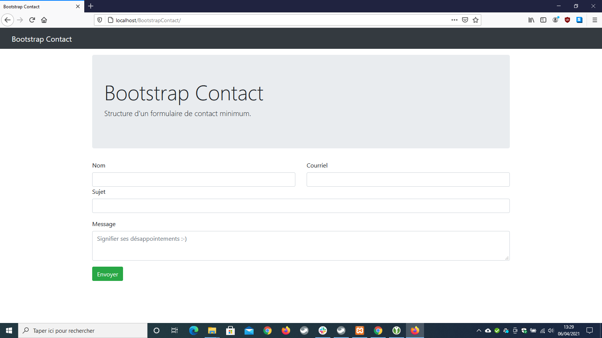

# BootstrapContact
Un formulaire contact PHP très simple

Sur le formulaire html il y a un `Input` de type `hidden` nommé `formRuse`, ceci pour déjouer les robots. Il est indispensable que ce champ soit vide pour envoyer le message.